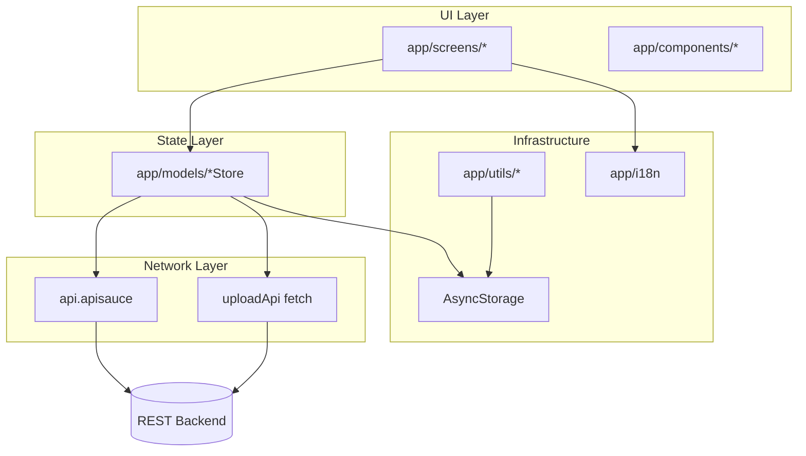
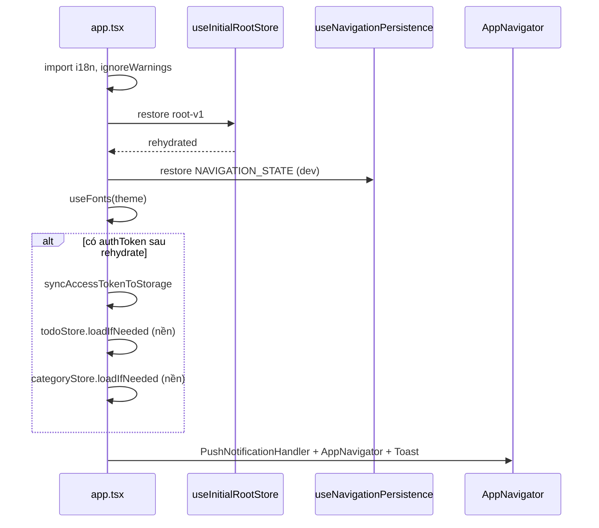
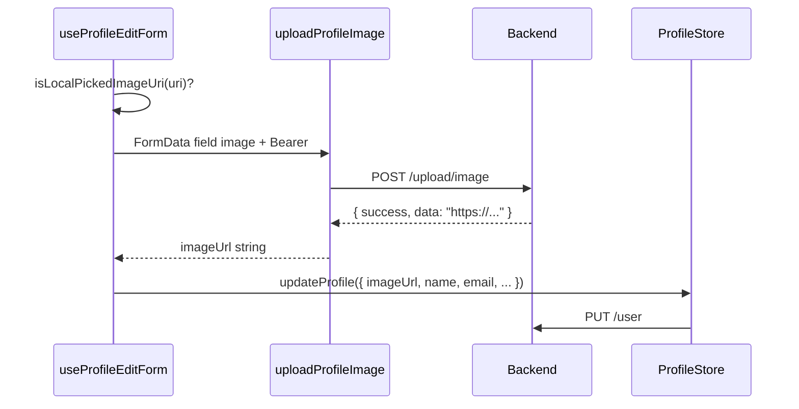

# todoIT — Tài liệu kỹ thuật dự án (bản chi tiết)

Ứng dụng quản lý công việc cá nhân (**React Native + Expo SDK 50**, **Ignite CLI**). Backend REST. Tài liệu mô tả **kiến trúc**, **lý do thiết kế**, **vị trí file**, **hợp đồng API**, **luồng từng màn hình**, **state**, **persist**, **i18n**, **upload**, **EAS** — dùng như handbook khi onboard hoặc demo/review.

> **Nguồn sự thật:** code trong `app/`. Nếu README lệch code, ưu tiên code.  
> **Tài liệu liên quan:** `DOCX_REVIEW_COMPARISON.md` (đối chiếu góp ý mentor), `DOC_DEMO_MAU.md` (kịch bản demo).

---

## Mục lục

### Phần A — Bắt đầu
- [A.1 Quick start (dev mới)](#a1-quick-start-dev-mới)
- [A.2 Tổng quan sản phẩm](#a2-tổng-quan-sản-phẩm)
- [A.3 Sơ đồ module](#a3-sơ-đồ-module)

### Phần B — Kiến trúc & cấu trúc
- [B.1 Kiến trúc 4 lớp](#b1-kiến-trúc-4-lớp)
- [B.2 Cây thư mục đầy đủ](#b2-cây-thư-mục-đầy-đủ)
- [B.3 Tech stack & phiên bản](#b3-tech-stack--phiên-bản)
- [B.4 Quy ước Ignite trong repo](#b4-quy-ước-ignite-trong-repo)

### Phần C — Cấu hình & build
- [C.1 Biến môi trường](#c1-biến-môi-trường)
- [C.2 `app.config.ts` / `app.json`](#c2-appconfigts--appjson)
- [C.3 EAS profiles](#c3-eas-profiles)
- [C.4 Scripts & thiết bị Android](#c4-scripts--thiết-bị-android)

### Phần D — Runtime app
- [D.1 Khởi động `app.tsx`](#d1-khởi-động-apptsx)
- [D.2 Persist & AsyncStorage](#d2-persist--asyncstorage)
- [D.3 Navigation](#d3-navigation)
- [D.4 Token & Authorization](#d4-token--authorization)

### Phần E — API backend
- [E.1 HTTP client (`api.ts`)](#e1-http-client-apits)
- [E.2 Bảng endpoint đầy đủ](#e2-bảng-endpoint-đầy-đủ)
- [E.3 Upload multipart (`uploadApi.ts`)](#e3-upload-multipart-uploadapits)
- [E.4 Kiểm tra success / lỗi](#e4-kiểm-tra-success--lỗi)

### Phần F — State (MobX-State-Tree)
- [F.1 RootStore](#f1-rootstore)
- [F.2 Nguyên tắc API-first](#f2-nguyên-tắc-api-first)
- [F.3 TodoStore](#f3-todostore)
- [F.4 CategoryStore](#f4-categorystore)
- [F.5 NotificationStore](#f5-notificationstore)
- [F.6 ProfileStore & AuthenticationStore](#f6-profilestore--authenticationstore)
- [F.7 `completeAuthSession`](#f7-completeauthsession)

### Phần G — Luồng nghiệp vụ từng feature
- [G.1 Auth (Login / SignUp / Logout)](#g1-auth-login--signup--logout)
- [G.2 Todo](#g2-todo)
- [G.3 Category](#g3-category)
- [G.4 Notification & Push](#g4-notification--push)
- [G.5 Profile & avatar (2 bước)](#g5-profile--avatar-2-bước)

### Phần H — UI & i18n
- [H.1 Components](#h1-components)
- [H.2 Theme](#h2-theme)
- [H.3 i18n — key & cách dùng](#h3-i18n--key--cách-dùng)

### Phần I — Vận hành & debug
- [I.1 Dev logging (`logDev`)](#i1-dev-logging-logdev)
- [I.2 Troubleshooting thường gặp](#i2-troubleshooting-thường-gặp)
- [I.3 Checklist EAS Build](#i3-checklist-eas-build)

### Phần J — Tương lai
- [J.1 Hạn chế hiện tại](#j1-hạn-chế-hiện-tại)
- [J.2 Hướng mở rộng](#j2-hướng-mở-rộng)

---

## A.1 Quick start (dev mới)

### Yêu cầu máy

| Công cụ | Ghi chú |
|---------|---------|
| Node.js | Khuyến nghị LTS; doc pet project gợi ý `fnm` |
| Package manager | Repo dùng script `bun` / `npm` tương đương (`package.json`) |
| Expo / EAS CLI | Development **build** (không chỉ Expo Go) |
| Android Studio / Xcode | Khi `expo run:android` / `ios` |

### Cài đặt lần đầu

```bash
cd d:\du_an_cong_viec\todoIT
cp .env.example .env
# Sửa EXPO_PUBLIC_API_URL trỏ backend thật (không commit .env)
npm install
npm run compile
npm run lint
```

### Chạy dev (Metro + dev client)

```bash
# Android thật/emulator: reverse Metro + mở dev client
npm run start:android

# Hoặc chỉ reverse port Metro
npm run adb:metro
npm run start:dev
```

### Kiểm tra nhanh sau khi clone

1. Login → vào tab **Todo** → kéo refresh → có list (hoặc empty).
2. Tạo todo → quay list → item xuất hiện **sau** API OK.
3. Tab **Profile** → đổi avatar → Save → ảnh HTTPS (Cloudinary URL từ server).

---

## A.2 Tổng quan sản phẩm

| Module | Chức năng | Store chính | API module |
|--------|-----------|-------------|------------|
| **Auth** | Login, SignUp, logout local | `authenticationStore` | `authApi` |
| **Todo** | CRUD, toggle, due date, reminder local | `todoStore` | `todoApi` |
| **Category** | CRUD, public/private | `categoryStore` | `categoryApi` |
| **Notification** | List, read, delete, push merge | `notificationStore` | `notificationApi` |
| **Profile** | GET/PUT user, avatar upload, xóa TK | `profileStore` | `userApi`, `uploadApi` |

### Đặc điểm kỹ thuật (bắt buộc nắm khi đọc code)

| Chủ đề | Cách làm hiện tại | Vì sao |
|--------|-------------------|--------|
| Mutation UI | **API-first** — API OK mới sửa `items` / `profile` | Tránh UI “ảo” khi mạng/backend lỗi |
| Cache list | MST persist + `loadIfNeeded` | Mở app nhanh; refresh chủ động |
| Avatar | `POST /upload/image` → `PUT /user` | Backend tách upload file và metadata user |
| HTTP file | `fetch` + `FormData` cho upload | `apisauce` hay làm hỏng multipart trên RN |
| Token | MST `authToken` + key `accessToken` | Một nguồn cho apisauce và `fetch` upload |
| Chuỗi UI | `i18n-js`, nguồn `en.ts` | Chuẩn Ignite l10n; `ar/fr/ko` mirror `en` |

---

## A.3 Sơ đồ module



---

## B.1 Kiến trúc 4 lớp

```
┌──────────────────────────────────────────────────────────────┐
│  screens/ + components/                                       │
│  - observer(MobX), navigation, Alert, hooks feature-specific   │
├──────────────────────────────────────────────────────────────┤
│  models/ (MobX-State-Tree)                                    │
│  - items, isLoading, flow(async), reset khi đổi user          │
├──────────────────────────────────────────────────────────────┤
│  services/api/                                                │
│  - endpoint, types, không import React                        │
├──────────────────────────────────────────────────────────────┤
│  utils/ + constants/ + config/                                │
│  - token, reminder, push, mapper, pagination, API_URL       │
└──────────────────────────────────────────────────────────────┘
```

### Luồng dữ liệu chuẩn

1. User thao tác trên **Screen** (hoặc hook gắn screen).
2. Screen gọi **`store.action()`** (generator `flow`).
3. Store gọi **`xxxApi`**.
4. Response → `isMutationSuccess` → cập nhật snapshot MST.
5. `observer` re-render list/form.

**Screen không nên:** gọi `api.apisauce` trực tiếp (trừ trường hợp đặc biệt đã có abstraction — hiện tại không có).

---

## B.2 Cây thư mục đầy đủ

```text
todoIT/
├── App.tsx                      # Re-export entry (Ignite)
├── app/
│   ├── app.tsx                  # Root component: store, navigator, push, toast
│   ├── components/              # UI tái sử dụng (Screen, ListView, *Item…)
│   ├── config/
│   │   ├── index.ts             # API_URL từ EXPO_PUBLIC_API_URL
│   │   ├── config.base.ts       # persistNavigation, exitRoutes, catchErrors
│   │   └── media.ts             # DEFAULT_TODO_IMAGE_URL (placeholder todo)
│   ├── constants/
│   │   ├── pagination.ts        # DEFAULT_LIST_PAGE_SIZE = 50
│   │   ├── todo.ts              # TODO_REMINDER_MINUTE_OPTIONS
│   │   └── auth.ts              # Hằng auth (nếu có)
│   ├── devtools/                # Reactotron (__DEV__)
│   ├── i18n/                    # en, ar, fr, ko, translate, i18n.ts
│   ├── models/
│   │   ├── RootStore.ts
│   │   ├── *Store.ts
│   │   └── helpers/
│   │       ├── setupRootStore.ts    # restore + onSnapshot persist
│   │       ├── useStores.ts
│   │       └── withSetPropAction.ts
│   ├── navigators/
│   │   ├── AppNavigator.tsx     # Native stack
│   │   ├── TabNavigator.tsx     # Bottom tabs
│   │   └── navigationUtilities.ts
│   ├── screens/                 # Mỗi feature một folder
│   ├── services/api/
│   ├── theme/                   # colors, typography, spacing
│   └── utils/                   # hooks & helpers cross-cutting
├── app.config.ts                # Expo dynamic config
├── app.json                     # permissions, plugins, EAS projectId
├── eas.json                     # build profiles + environment
├── .env.example
├── google-services.json         # FCM Android
├── plugins/                     # Expo config plugins
└── test/                        # Jest
```

### Map màn hình → route

| Folder `app/screens/` | Route / Tab | File export chính |
|----------------------|-------------|-------------------|
| `LoginScreen/` | Stack `Login` | `LoginScreen.tsx` |
| `SignUpScreen/` | Stack `SignUp` | `SignUpScreen.tsx` |
| `TodoScreen/` | Tab `Todo` | `TodoScreen.tsx` |
| `TodoFormScreen/` | (nhúng) | `TodoFormScreen.tsx` — props `mode: create \| edit` |
| `NewTodoScreen/` | Stack `NewTodo` | bọc form `mode="create"` |
| `EditTodoScreen/` | Stack `EditTodo` | bọc form `mode="edit"` + `todoData` param |
| `TodoDetailScreen/` | Stack `TodoDetail` | `{ id }` |
| `CategoriesScreen/` | Tab `Categories` | list + FAB |
| `NewCategoryScreen/` | Stack `NewCategory` | |
| `EditCategoryScreen/` | Stack `EditCategory` | `{ categoryData }` |
| `NotificationsScreen/` | Tab `Notifications` | |
| `NotificationDetailScreen/` | Stack `NotificationDetail` | `{ notificationData }` |
| `ProfileScreen/` | Tab `Profile` | hooks profile |
| `ErrorScreen/` | Error boundary | `ErrorBoundary.tsx` |

**Vì sao tách `NewTodoScreen` / `EditTodoScreen`:** Ignite pattern — route stack riêng, form logic gom `TodoFormScreen` tránh duplicate.

---

## B.3 Tech stack & phiên bản

| Nhóm | Package (chính) | Vai trò trong dự án |
|------|-----------------|---------------------|
| Runtime | `expo@^50`, `react-native@0.73.4` | Dev client, native modules |
| Navigation | `@react-navigation/native-stack`, `bottom-tabs` | Stack auth + 4 tab |
| State | `mobx`, `mobx-state-tree`, `mobx-react-lite` | Global store + `flow` |
| HTTP | `apisauce@3` | JSON REST |
| Upload | `fetch` + `FormData` | Multipart ảnh |
| List | `@shopify/flash-list` (qua `ListView`) | Performance list |
| Thời gian | `date-fns` | Format trong `formatDate.ts` |
| Push | `expo-notifications`, `expo-device` | Token + listener |
| Ảnh | `expo-image-picker` | Avatar |
| i18n | `i18n-js`, `expo-localization` | UI strings |
| Toast | `react-native-toast-message` | Foreground notification |

---

## B.4 Quy ước Ignite trong repo

| Quy ước | Ví dụ trong repo |
|---------|------------------|
| Screen một folder | `LoginScreen/LoginScreen.tsx` |
| Export screens qua barrel | `app/screens/index.ts` |
| `observer` bọc screen dùng store | `TodoScreen`, `AppNavigator` |
| Generator anchor | `IGNITE_GENERATOR_ANCHOR_*` trong `AppNavigator` |
| Config tách `config.base` / `index` | API_URL từ env, base từ file tĩnh |
| Component dùng `tx` / `Text` | `app/components/Text.tsx` |

**Không dùng nữa (so với bản doc cũ):** màn `Welcome`, optimistic temp id todo/category.

---

## C.1 Biến môi trường

### Bảng biến

| Biến | Đọc tại | Bắt buộc | Mô tả |
|------|---------|----------|--------|
| `EXPO_PUBLIC_API_URL` | `app/config/index.ts` → `Config.API_URL` | **Có** | Base URL backend. Upload tự `trim` slash cuối. |
| `EXPO_PUBLIC_EAS_PROJECT_ID` | `app.config.ts` | Không | Ghi đè project id nếu cần |

### Local

```bash
cp .env.example .env
# EXPO_PUBLIC_API_URL=https://api.example.com
```

File `.env` **gitignore** — không commit secret/production URL nhầm.

### EAS Cloud (expo.dev)

Project → **Environment variables** — tên biến **giống hệt** local:

| Profile trong `eas.json` | `environment` EAS |
|--------------------------|-------------------|
| `development`, `development:device` | `development` |
| `preview`, `preview:device` | `preview` |
| `production` | `production` |

**Hậu quả thiếu URL trên EAS:** APK cài từ cloud build gọi `baseURL` rỗng → login/network fail. Dev log `[api] EXPO_PUBLIC_API_URL is empty` chỉ có trên bản `__DEV__`.

### Không cần trên client

- Cloudinary API key/secret — server xử lý trong `POST /upload/image`.

---

## C.2 `app.config.ts` / `app.json`

| File | Nội dung quan trọng |
|------|---------------------|
| `app.json` | `expo.name`, `slug`, permissions (`expo-image-picker` message), `extra.eas.projectId`, plugins notifications |
| `app.config.ts` | Merge config động, đọc env, `expo-build-properties`, splash, v.v. |

**Lưu ý demo:** permission camera/gallery trong `app.json` có thể vẫn tiếng Việt — chưa qua i18n (native string).

---

## C.3 EAS profiles

File: `eas.json`

| Profile | Mục đích | Android | Environment |
|---------|----------|---------|-------------|
| `development` | Dev, simulator iOS | `assembleDebug` | development |
| `development:device` | Dev trên máy thật | debug APK | development |
| `preview` | Tester nội bộ | **APK** `buildType: apk` | preview |
| `preview:device` | iOS device preview | | preview |
| `production` | Store | AAB (mặc định EAS) | production |

Script local (cần EAS CLI + credentials):

```bash
npm run build:android:dev
npm run build:android:prod
```

---

## C.4 Scripts & thiết bị Android

| Script | Việc làm |
|--------|----------|
| `npm run compile` | `tsc --noEmit` — bắt lỗi type toàn project |
| `npm run lint` | ESLint + Prettier trên `app/`, `test/` |
| `npm run test` | Jest |
| `npm start` | `expo start` |
| `npm run adb:metro` | `adb reverse tcp:8081` — máy Android gọi Metro PC |
| `npm run start:android` | reverse + dev client + mở Android |
| `npm run start:dev` | reverse + dev client |
| `npm run start:lan` | Expo LAN (thiết bị cùng WiFi) |
| `npm run android` | `expo run:android` native build local |

**Vì sao `adb reverse`:** Dev client trên USB cần truy cập Metro `localhost:8081` trên PC.

---

## D.1 Khởi động `app.tsx`

**File:** `app/app.tsx`

### Thứ tự bootstrap



### Chi tiết từng bước

| Bước | Code / hook | Vì sao |
|------|-------------|--------|
| Reactotron | `require("./devtools/ReactotronConfig")` nếu `__DEV__` | Debug MST/network |
| i18n | `import "./i18n"` | Set locale trước render |
| Root store | `useInitialRootStore` → `setupRootStore` | Persist MST |
| Navigation persist | `useNavigationPersistence` + key `NAVIGATION_STATE` | Chỉ khi `persistNavigation: "dev"` trong `config.base` |
| Push | `PushNotificationHandler` → `usePushNotifications()` | Listener sống suốt app lifecycle |
| Splash | `consumeSplashHideRequest` / `hideSplashScreen` | Tránh flash trắng |

### Điều kiện render

`shouldShowApp = rehydrated && navigationRestored && fontsLoaded` (hoặc đã mount navigator trong session — tránh flicker).

---

## D.2 Persist & AsyncStorage

### Keys quan trọng

| Key | Nội dung | Ghi bởi |
|-----|----------|---------|
| `root-v1` | Snapshot **toàn bộ** `RootStore` | `onSnapshot` trong `setupRootStore.ts` |
| `accessToken` | JWT string (không có prefix Bearer) | `completeAuthSession`, `syncAccessTokenToStorage` |
| `NAVIGATION_STATE` | JSON navigation (dev) | `useNavigationPersistence` |
| Todo reminder map | `todoId → reminderMinutes` | `todoReminder.ts` |
| Local notification log | Backup notification | `localNotificationLog.ts` |

### Logic restore đặc biệt (`setupRootStore.ts`)

| Store field khi restore | Xử lý |
|-------------------------|--------|
| `todoStore.isLoaded` / `categoryStore.isLoaded` | Giữ từ snapshot — **không** ép `false` (tránh GET lại mỗi lần cold start nếu đã có cache) |
| `notificationStore.isLoaded` | Ép `false` — luôn fetch lại khi vào tab |
| `notificationStore.unreadCount` | Tính lại từ `items` (tránh badge lệch persist) |
| `profileStore.isLoaded` | `true` nếu có `profile` trong snapshot |

**Logout / xóa account:** `useProfileSession` xóa `root-v1` + `accessToken` + `authenticationStore.logout()`.

---

## D.3 Navigation

### Stack — `app/navigators/AppNavigator.tsx`

**Màn đầu:** `Login` (không `Welcome`).

```typescript
// AppStackParamList (rút gọn)
Login: undefined
SignUp: undefined
MainTabs: NavigatorScreenParams<TabParamList> | undefined
NewTodo: undefined
TodoDetail: { id: string }
EditTodo: { todoData: EditTodoRouteData }
NewCategory: undefined
EditCategory: { categoryData: Category }
NotificationDetail: { notificationData: Notification }
```

- `EditTodoRouteData`: `Todo` nhưng `category` có thể `null` (mapper từ list).
- `navigationRef` + `useBackButtonHandler`: Android back ở `Login` thoát app (`exitRoutes`).

### Tab — `TabNavigator.tsx`

| Tab name | Screen | Label i18n |
|----------|--------|------------|
| `Categories` | CategoriesScreen | `tabs.categories` |
| `Todo` | TodoScreen | `tabs.todos` |
| `Notifications` | NotificationsScreen | `tabs.notifications` |
| `Profile` | ProfileScreen | `tabs.profile` |

`detachInactiveScreens={false}` — tab không unmount → giữ scroll/state list (đặc biệt Android).

### Deep linking (một phần)

`app.tsx` `linking.config` còn anchor Ignite demo (`Demo`…) — production flow chính vẫn stack `Login`.

---

## D.4 Token & Authorization

**File:** `app/utils/accessToken.ts`

| Hàm | Hành vi |
|-----|---------|
| `normalizeAccessToken` | Trim, bỏ `Bearer ` lặp, bỏ `"null"` |
| `getAccessToken(preferred?)` | Ưu tiên tham số (vd `authToken` store) → else `loadString("accessToken")` |
| `syncAccessTokenToStorage` | Sau rehydrate: MST token → AsyncStorage |

**Apisauce** (`api.ts`): mỗi request gắn `Authorization: Bearer ${token}` nếu chưa có header.

**Upload** (`uploadApi.ts`): gọi `getAccessToken(authToken)` — truyền `authenticationStore.authToken` từ `useProfileEditForm` để tránh đọc storage cũ.

### Lỗi token thường gặp

| Triệu chứng | Nguyên nhân | Hướng xử lý |
|-------------|-------------|-------------|
| Upload 401 / Invalid token | Storage lệch MST sau login | Đăng xuất → login lại; kiểm tra `syncAccessTokenToStorage` |
| API OK nhưng upload fail | Gọi upload không truyền token store | Đã fix qua `getAccessToken(authToken)` |

---

## E.1 HTTP client (`api.ts`)

**Class `Api`:**

- `baseURL: Config.API_URL`
- `timeout: 10000` ms
- Request transform: Bearer + log `→ METHOD path` (dev)
- Monitor: log response khi **lỗi** (`shouldLogApisauceResponse`)

**Export singleton:** `export const api = new Api()` — mọi `*Api.ts` dùng `api.apisauce`.

---

## E.2 Bảng endpoint đầy đủ

Base: `{EXPO_PUBLIC_API_URL}`. Tất cả JSON trừ upload.

### Auth — `authApi.ts`

| Method | Path | Body | Response data (khi OK) | Gọi từ |
|--------|------|------|------------------------|--------|
| POST | `/auth/sign-in` | `{ email, password }` | `data.accessToken`, user fields | `LoginScreen` |
| POST | `/auth/sign-up` | `{ email, password, name }` | như sign-in | `SignUpScreen` |
| POST | `/auth/sign-out` | — | `ApiResult` | *(client ít dùng — logout chủ yếu local)* |

### Todo — `todoApi.ts`

| Method | Path | Body / Query | Store action |
|--------|------|--------------|--------------|
| GET | `/todo/all` | `page`, `size` (default 0, 50) | `fetchTodos` |
| GET | `/todo/{id}` | — | *(có thể dùng detail nếu mở rộng)* |
| POST | `/todo` | `CreateTodoPayload` | `createTodo` |
| PUT | `/todo/{id}` | `CreateTodoPayload` | `updateTodo` |
| PATCH | `/todo/{id}/toggle-completed` | `{ isCompleted }` | `toggleTodoStatus` |
| DELETE | `/todo/{id}` | — | `deleteTodo` |

`CreateTodoPayload`: `{ title, content, imageUrl, dueDate, categoryId }`.

### Category — `categoryApi.ts`

| Method | Path | Body | Store action |
|--------|------|------|--------------|
| GET | `/category/all` | — | `fetchCategories` |
| POST | `/category` | `{ name, isPublic }` | `createCategory` |
| PUT | `/category/{id}` | `{ name, isPublic }` | `updateCategory` |
| DELETE | `/category/{id}` | — | `deleteCategory` |

### Notification — `notificationApi.ts`

| Method | Path | Ghi chú | Store |
|--------|------|---------|-------|
| GET | `/notification/all` | `page`, `size` | `fetchNotifications` |
| GET | `/notification/unread-count` | | có thể dùng riêng |
| POST | `/notification` | `{ userId, title, content }` | server/push |
| PATCH | `/notification/mark-read/{id}` | | `markRead` |
| PATCH | `/notification/mark-read/all` | | mark all |
| DELETE | `/notification/{id}` | | `deleteNotification` |
| DELETE | `/notification/all` | | delete all |

### User — `userApi.ts`

| Method | Path | Body | Store / hook |
|--------|------|------|--------------|
| GET | `/user/me` | — | `fetchProfile` |
| GET | `/user/{id}` | — | *(ít dùng)* |
| PUT | `/user` | `UpdateUserPayload` | `updateProfile` |
| DELETE | `/user` | — | `deleteAccount` |
| PATCH | `/user/update-push-token` | `{ pushToken }` | `syncExpoPushTokenWithServer` |

`UpdateUserPayload`: `{ name?, email?, password?, imageUrl? }`.

### Upload — `uploadApi.ts`

| Method | Path | Body | Trả về |
|--------|------|------|--------|
| POST | `/upload/image` | `multipart/form-data`, field **`image`** | `string` URL trong `data` |

---

## E.3 Upload multipart (`uploadApi.ts`)

### Vì sao không dùng apisauce?

Trên React Native, `FormData` + axios/apisauce dễ set sai `Content-Type` → server không parse file → **400 missing image**.

### Luồng chi tiết



### `LocalImageFilePart`

```typescript
{ uri: string; mimeType?: string | null; fileName?: string | null }
```

- `useAvatarImagePicker` cung cấp `mimeType` / `fileName` từ `expo-image-picker`.
- Fallback `guessMimeAndName(uri)` từ extension.

### Mã lỗi throw (catch ở UI)

| `Error.message` | Ý nghĩa | i18n alert |
|-----------------|---------|------------|
| `AUTH_REQUIRED` | Không có token | `profileScreen.imageUploadAuthError` |
| `AUTH_INVALID` | 401 / Invalid token | `profileScreen.imageUploadAuthError` |
| `UPLOAD_BAD_REQUEST` | 400 | `profileScreen.imageUploadBadRequest` |
| Khác | Message server hoặc parse JSON fail | `imageUploadFailed` (+ dev: raw message) |

### `imageUrl` hợp lệ cho `PUT /user`

- Phải là **direct URL** ảnh (vd Cloudinary `https://res.cloudinary.com/...`).
- **Không** dùng: trang web ibb.co, BBCode `[img]`, base64 trong JSON user.

---

## E.4 Kiểm tra success / lỗi

**File:** `app/utils/isMutationSuccess.ts`

```typescript
response.ok && response.data?.success !== false
```

**Delete idempotent:**

```typescript
isDeleteMutationSuccess(response) // hoặc status === 404
```

**Screen pattern:**

```typescript
const response = await todoStore.deleteTodo(id)
if (!isMutationSuccess(response)) {
  Alert.alert(translate("common.error"), translate("todoScreen.deleteFailed"))
}
```

**Store pattern:** không sửa `items` khi `!isMutationSuccess(response)`.

---

## F.1 RootStore

**File:** `app/models/RootStore.ts`

```typescript
{
  authenticationStore,
  categoryStore,
  todoStore,
  notificationStore,
  profileStore,
}
```

**Hook:** `useStores()` từ `app/models/helpers/useStores.ts` — destructure trong screen `observer`.

---

## F.2 Nguyên tắc API-first

### So sánh với optimistic (đã bỏ)

| | Optimistic (cũ) | API-first (hiện tại) |
|--|-----------------|----------------------|
| UI list | Cập nhật ngay, temp id | Chờ `response.ok` |
| Rollback | Phải hoàn tác khi fail | Không cần — UI chưa đổi |
| UX | Nhanh hơn cảm giác | Hơi trễ nhưng đúng server |

### Ví dụ `createTodo` (`TodoStore.ts`)

1. `yield todoApi.createTodo(payload)`
2. Nếu fail → `return response` (list không đổi)
3. Nếu OK + có `createdTodo` → `items.replace([normalized, ...])` + schedule reminder
4. Nếu OK nhưng không có entity → `fetchTodos()` fallback + match theo title/content/dueDate

---

## F.3 TodoStore

**File:** `app/models/TodoStore.ts`

### Model fields (mỗi todo)

| Field | Kiểu | Ghi chú |
|-------|------|---------|
| `id` | identifier | |
| `title`, `content` | string | |
| `imageUrl` | string | Từ server |
| `dueDate` | number | Unix ms |
| `isCompleted` | boolean | |
| `reminderMinutes` | number | **Client-only** merge từ AsyncStorage map |
| `category` | nested hoặc null | |

### Actions

| Action | API | Sau success |
|--------|-----|-------------|
| `fetchTodos` | GET `/todo/all` | `items.replace`, merge `reminderMinutes` map |
| `loadIfNeeded` | — | Nếu đã có `items` từ persist → set `isLoaded`, **không GET**; else `fetchTodos` |
| `createTodo` | POST | Thêm item hoặc refetch |
| `updateTodo` | PUT | `applySnapshot` item hoặc refetch |
| `toggleTodoStatus` | PATCH | Map `isCompleted` |
| `deleteTodo` | DELETE | Filter id + `cancelTodoReminder` |
| `resetForAuthChange` | — | Clear items, hủy mọi reminder local |

**Reminder:** `app/utils/todoReminder.ts` — lưu map phút trước deadline; schedule notification local sau mutation OK.

---

## F.4 CategoryStore

**File:** `app/models/CategoryStore.ts`

| Action | Hành vi sau API OK |
|--------|-------------------|
| `fetchCategories` | Replace `items` |
| `loadIfNeeded` | Tương tự todo — có items persist thì skip GET |
| `createCategory` | **Refetch** toàn list (server quyết id/quyền) |
| `updateCategory` | Patch item tại index hoặc refetch |
| `deleteCategory` | Filter id (success từ `response.ok && data.success`) |

**View `sortedItems`:** `localeCompare` tên — UI không sort lại.

---

## F.5 NotificationStore

**File:** `app/models/NotificationStore.ts`

### Đặc thù merge local + server

1. `fetchNotifications` GET server + `loadLocalNotificationLog()`.
2. Merge theo `id` trong `Map`.
3. `dedupeMergedNotifications` — gộp bản trùng nội dung (local-* vs server id) theo bucket phút.
4. `syncUnreadCount()` từ `items`.

### Actions chính

| Action | Mô tả |
|--------|--------|
| `fetchNotifications` | Load + merge + sort `sentAt` desc |
| `markRead` / `markAllRead` | API + cập nhật local log |
| `deleteNotification` | API + `purgeNotificationFromLocalLog` |
| `addIncomingNotification` | Push foreground/background → store + local log |
| `resetForAuthChange` | Clear items, unread, local log |

**Delete success:** dùng `isDeleteMutationSuccess` (404 coi như đã xóa).

---

## F.6 ProfileStore & AuthenticationStore

### AuthenticationStore

- Prop: `authToken?: string`
- Persist trong `root-v1`
- `logout()` clear token

### ProfileStore

| Action | API |
|--------|-----|
| `fetchProfile` | GET `/user/me` |
| `loadIfNeeded` | Skip nếu `isLoaded` |
| `updateProfile` | PUT `/user` |
| `deleteAccount` | DELETE `/user` |
| `clearProfile` | Reset khi login user khác |

---

## F.7 `completeAuthSession`

**File:** `app/utils/completeAuthSession.ts`

**Khi nào gọi:** Login / SignUp success.

**Thứ tự (quan trọng):**

1. `profileStore.clearProfile()` — tránh `loadIfNeeded` bỏ qua GET `/me` vì `isLoaded` + email cũ.
2. `notificationStore.resetForAuthChange()`
3. `todoStore.resetForAuthChange()` (+ cancel reminders)
4. `categoryStore.resetForAuthChange()`
5. `authenticationStore.setProp("authToken", accessToken)`
6. `saveString("accessToken", token)`
7. `syncExpoPushTokenWithServer(token)` (catch silent)
8. `todoStore.loadIfNeeded()` / `categoryStore.loadIfNeeded()` — **không await** (không block UI Login)
9. `navigation.navigate("MainTabs")`

---

## G.1 Auth (Login / SignUp / Logout)

### Login — `LoginScreen.tsx`

1. Validate email/password (UI).
2. `authApi.signIn(email, password)`.
3. Nếu `response.ok && data.success` → `completeAuthSession(..., data.data.accessToken)`.
4. Else `Alert` + `logApisauceResponse("auth", response)` trong `__DEV__`.

### SignUp — `SignUpScreen.tsx`

Tương tự với `authApi.signUp` + `completeAuthSession`.

### Logout — `useProfileSession.ts`

`finishSession`:

- Clear AsyncStorage keys (`accessToken`, `root-v1`, …)
- `authenticationStore.logout()`
- Reset stores
- `navigation.reset({ routes: [{ name: "Login" }] })`

*(Tùy backend: có thể gọi thêm `authApi.signOut()` trước khi clear local.)*

---

## G.2 Todo

### TodoScreen — `TodoScreen.tsx`

| UX | Implementation |
|----|----------------|
| List | `ListView` + `TodoItem`, data `toPlainTodo` |
| Refresh | `pullRefreshing` state **tách** `todoStore.isLoading` — tránh nhấp nháy RefreshControl Android |
| Blocking loader | Chỉ khi `isLoading && items.length === 0` |
| Toggle | `handleToggleStatus` → store → Alert nếu fail |
| Delete | Confirm `Alert` → `deleteTodo` |
| FAB | Navigate `NewTodo` |

**Không** auto `fetchTodos` mỗi focus nếu đã có cache — user kéo refresh hoặc sau mutation.

### TodoFormScreen — `TodoFormScreen.tsx`

| Field UI | Gửi API |
|----------|---------|
| title, content | string |
| category dropdown | `categoryId` |
| due date picker | `dueDate` ms |
| reminder chips | `reminderMinutes` (local map, không field API riêng) |
| image | **`DEFAULT_TODO_IMAGE_URL`** từ `app/config/media.ts` — placeholder, **chưa** chọn ảnh thật |

### TodoDetailScreen

- Load todo từ store theo `id` param (hoặc fetch nếu thiếu).
- Toggle, delete, navigate `EditTodo` với `todoData`.

### NewTodo / EditTodo

Wrapper mỏng truyền `mode` và `initialValues` / `todoData`.

---

## G.3 Category

| Màn | Store calls |
|-----|-------------|
| `CategoriesScreen` | `fetchCategories` on focus / refresh |
| `NewCategoryScreen` | `createCategory` → Alert → back |
| `EditCategoryScreen` | `updateCategory`, `deleteCategory` + confirm |

Public toggle: `isPublic` boolean gửi thẳng API.

---

## G.4 Notification & Push

### `usePushNotifications.ts`

| Việc | Chi tiết |
|------|----------|
| Permission | `expo-notifications` |
| Expo push token | Gửi server qua `userApi.updatePushToken` |
| Foreground | Listener → `notificationStore.addIncomingNotification` + **Toast** |
| Background / tap | Điều hướng `Notifications` tab hoặc `NotificationDetail` qua `navigationRef` |

### `NotificationsScreen.tsx`

- Pull refresh → `fetchNotifications`
- Mark read, delete (confirm), delete all
- Empty → `EmptyState` + i18n

### Local log — `localNotificationLog.ts`

Backup khi push tới nhưng list server chưa kịp có; purge khi xóa trên server.

**Chuỗi tiếng Việt còn sót:** một số title/body trong `todoReminder.ts` / push handler — nên chuyển vào `en.ts` (xem `DOCX_REVIEW_COMPARISON.md`).

---

## G.5 Profile & avatar (2 bước)

### Hooks trên ProfileScreen

| Hook / file | Trách nhiệm |
|-------------|-------------|
| `useProfileLoadOnFocus.ts` | `fetchProfile` khi focus tab |
| `useProfileEditForm.ts` | State form, `saveProfile`, upload |
| `useAvatarImagePicker.ts` | `launchImageLibraryAsync` / camera → `setEditImageFromPicker` |
| `useProfileSession.ts` | Sign out, delete account confirm |

### `saveProfile` logic (`useProfileEditForm.ts`)

```text
1. Validate name, email, password (getPasswordValidationError + i18n)
2. Nếu ảnh URI local (file://, content://, …):
     uploadProfileImage → resolvedImageUrl
   Else nếu URL https giữ nguyên
   Else ảnh rỗng → undefined (xóa ảnh tùy backend)
3. Build UpdateUserPayload (chỉ gửi password nếu non-empty)
4. profileStore.updateProfile(payload)
5. Alert success / error
```

### UI avatar

- View mode: `AutoImage` / URI từ `profile.imageUrl`
- Edit mode: preview `editImageUrl` (local hoặc remote)

---

## H.1 Components

Export: `app/components/index.ts`

| Component | Props / hành vi quan trọng | Dùng ở |
|-----------|---------------------------|--------|
| `Screen` | `preset`, safe area, keyboard | Mọi màn |
| `AppSectionHeader` | `titleTx`, refresh, back — `paddingBottom: 0` | Tab + stack con |
| `Text` | `tx`, `text`, `i18nOptions` | Labels |
| `TextField` | `labelTx`, `placeholderTx`, validation | Forms |
| `Button` | `tx`, loading | Submit |
| `ListView` | Wrap FlashList, refresh props | Lists |
| `TodoItem` | `onToggle`, `onEdit`, `onDelete` | TodoScreen |
| `CategoryItem` | navigate edit | CategoriesScreen |
| `NotificationItem` | read state styling | NotificationsScreen |
| `EmptyState` | `headingTx`, `contentTx` | Empty lists |
| `AutoImage` | URI remote/local | Profile, todo image |
| `Toggle` | Switch | Category public, form |
| `Icon` | Feather set | FAB, header |

**Vì sao `AppSectionHeader` bỏ padding bottom:** tránh khoảng trắng thừa giữa header và list (yêu cầu UI).

---

## H.2 Theme

**Thư mục:** `app/theme/`

| File | Nội dung |
|------|----------|
| `colors.ts` / `palette` | Màu brand, background, error |
| `typography.ts` | Font Space Grotesk |
| `spacing.ts` | Khoảng cách chuẩn |
| `styles.ts` | Shared styles |

Screen-specific: `*.styles.ts` cạnh screen (vd `TodoScreen.styles.ts`) — tách khỏi logic.

---

## H.3 i18n — key & cách dùng

### Cấu trúc file

| File | Vai trò |
|------|---------|
| `en.ts` | **Nguồn** type `Translations` |
| `ar.ts`, `fr.ts`, `ko.ts` | Cùng cấu trúc (hiện mirror EN) |
| `i18n.ts` | `i18n.translations`, locale máy, RTL Ả Rập |
| `translate.ts` | `translate(key)`, `TxKeyPath` |

### Nhóm key theo màn (`en.ts`)

| Namespace | Nội dung ví dụ |
|-----------|----------------|
| `common` | `error`, `success`, `confirm`, `cancel`, `delete` |
| `tabs` | `categories`, `todos`, `notifications`, `profile` |
| `loginScreen` | title, placeholders, errors |
| `signUpScreen` | tương tự |
| `profileScreen` | edit, password rules, upload errors, delete account |
| `categoriesScreen`, `newCategoryScreen`, `editCategoryScreen` | CRUD labels |
| `todoScreen`, `todoFormScreen`, `todoDetailScreen` | list, form, detail |
| `notificationsScreen`, `notificationDetailScreen` | |
| `errorScreen` | boundary |

### Cách dùng trong code

```tsx
// Component
<Text tx="loginScreen.title" />
<Button tx="common.save" />

// Alert / dynamic
Alert.alert(translate("common.error"), translate("todoScreen.deleteFailed"))

// TextField
<TextField labelTx="loginScreen.emailLabel" placeholderTx="loginScreen.emailPlaceholder" />
```

**Thêm key mới:** sửa `en.ts` trước → đồng bộ `ar/fr/ko` (copy structure) → dùng `tx` hoặc `translate`.

---

## I.1 Dev logging (`logDev`)

**File:** `app/utils/logDev.ts`  
**Điều kiện:** `__DEV__ === true` (Metro, EAS development). **Preview/production APK không log.**

| Tag | Khi nào |
|-----|---------|
| `[api]` | Mọi request `→ METHOD url`; response lỗi qua monitor |
| `[upload]` | POST `/upload/image` request/response/status |
| `[profile]` | PUT `/user` success (dev) |
| `[auth]` | Token sync sau rehydrate |

**Không log:** JWT đầy đủ, password, body nhạy cảm.

### Xem log

| Nền | Nơi xem |
|-----|---------|
| Metro | Terminal `npx expo start` |
| Android | `adb logcat` hoặc Android Studio |
| iOS | Xcode console |
| Reactotron | App dev menu (nếu bật config) |

---

## I.2 Troubleshooting thường gặp

### Login / API “Network Error”

| Kiểm tra | Hành động |
|----------|-----------|
| `.env` / EAS env | `EXPO_PUBLIC_API_URL` đúng, HTTPS, máy/emulator truy cập được |
| Android emulator | URL `10.0.2.2` thay `localhost` nếu backend local |
| Thiết bị thật | Dùng IP LAN hoặc `adb reverse` cho port API |
| Dev log | `[api] EXPO_PUBLIC_API_URL is empty` |

### Upload avatar 400 / missing image

- Đảm bảo field tên **`image`** (đúng Swagger).
- Dùng dev build để xem `[upload]` status + `bodyPreview`.
- Không gửi base64 trong `PUT /user`.

### Upload 401 Invalid token

- Logout → login lại.
- Kiểm tra `getAccessToken(authenticationStore.authToken)` khi save profile.

### List todo không cập nhật sau tạo

- Xem response POST có trả entity không — store có fallback `fetchTodos`.
- Kéo refresh thủ công.

### Reminder không kêu

- Permission notification OS.
- App bị kill — OEM Android có thể chặn alarm; cần push server cho production.

### Lint fail `reactotron/no-tron-in-production`

- Bọc `console.tron` trong `if (__DEV__) { }` hoặc dùng `logDev` thay thế.

---

## I.3 Checklist EAS Build

Trước `eas build --profile preview` (hoặc production):

- [ ] `EXPO_PUBLIC_API_URL` trên expo.dev đúng **environment** của profile
- [ ] Backend có `POST /upload/image`, `PUT /user`, auth routes
- [ ] `google-services.json` tồn tại (push Android)
- [ ] `npm run compile` && `npm run lint` pass trên nhánh build
- [ ] Tester gỡ APK cũ / đăng nhập lại sau đổi API URL
- [ ] Hiểu: **preview/production** không có `[api]` log — debug bằng development build hoặc reproduce trên Metro

---

## J.1 Hạn chế hiện tại

1. **Todo image** — luôn gửi `DEFAULT_TODO_IMAGE_URL`; UI “Image” chưa upload thật.
2. **Reminder** — chỉ local; không đảm bảo khi app killed.
3. **Pagination** — `DEFAULT_LIST_PAGE_SIZE = 50`; chưa infinite scroll.
4. **i18n** — push/reminder/permission native chưa 100% English.
5. **Sign-out server** — logout chủ yếu xóa local session.
6. **Navigation linking** — còn scaffold Demo Ignite trong `app.tsx`.

---

## J.2 Hướng mở rộng

| Hướng | Gợi ý triển khai |
|-------|------------------|
| Todo ảnh | Reuse `uploadApi` + field trong `CreateTodoPayload` |
| `vi.ts` | Thêm locale + `i18n.translations.vi` |
| Server reminder | Cron + `notificationApi.createNotification` |
| Sign-out | Gọi `authApi.signOut()` trong `finishSession` |
| Tests | Jest store flows với mock apisauce |

---

## Phụ lục — Bảng tra file theo câu hỏi

| Câu hỏi | File |
|---------|------|
| Đổi API URL? | `.env`, `app/config/index.ts`, expo.dev EAS env |
| Thêm màn stack? | `AppNavigator.tsx` + `screens/index.ts` + `AppStackParamList` |
| Thêm chuỗi UI? | `app/i18n/en.ts` |
| Sửa logic sau login? | `completeAuthSession.ts` |
| Sửa upload ảnh? | `uploadApi.ts`, `useProfileEditForm.ts` |
| Sửa merge notification? | `NotificationStore.ts`, `localNotificationLog.ts` |
| Sửa persist? | `setupRootStore.ts` |
| Thêm API endpoint? | `services/api/*Api.ts` + store `flow` |

---

*Tài liệu bản chi tiết — API-first mutations, Login-first, i18n `en.ts`, avatar upload 2 bước, `logDev`, EAS environments. Cập nhật README khi thay đổi hợp đồng backend hoặc flow auth/upload.*
